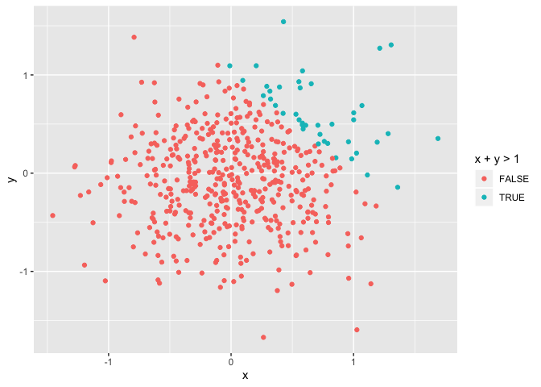
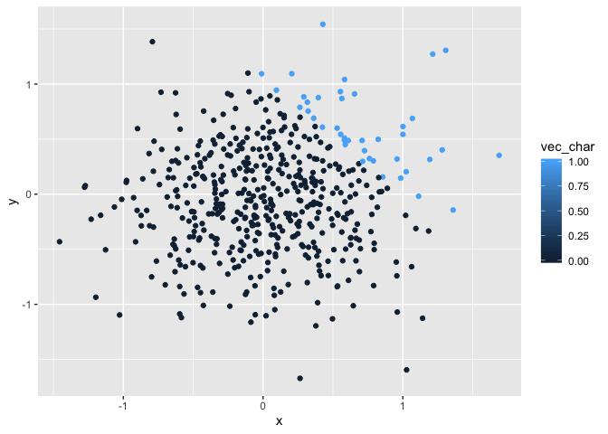

p8105\_hw1\_LG2982
================
Lizbeth Gomez
9/15/2019

``` r
problem_1_df = tibble(
  x = rnorm(8, sd = .5), #Created a random sample with 8 observations
  vec_logical = (x> 0),  # Cretes a logical vector that makes all x obs >0
  vec_char = c("Coding", "in", "R", "language", "is", "so", "much","fun"), #created a vector with a character
  vec_factor = factor(c("male", "male", "female", "female","male", "male", "female", "female")) # created a variable with two level factor
)

problem_1_df%>%
  summarise(meanx = mean(x))  # the mean of x (a random sample of size 8 from a standard Normal distribution is 0.0563209   )
```

    ## # A tibble: 1 x 1
    ##     meanx
    ##     <dbl>
    ## 1 -0.0151

``` r
problem_1_df%>%
  summarise(meanlog = mean(vec_logical)) # mean of this is 0.375    
```

    ## # A tibble: 1 x 1
    ##   meanlog
    ##     <dbl>
    ## 1     0.5

``` r
problem_1_df%>%
  summarise(meanchar = mean(vec_char)) # cant do this because is a character vector
```

    ## Warning in mean.default(vec_char): argument is not numeric or logical:
    ## returning NA

    ## # A tibble: 1 x 1
    ##   meanchar
    ##      <dbl>
    ## 1       NA

``` r
problem_1_df%>%
  summarise(meanfact = mean(vec_factor)) #cant do this because is a factor vector
```

    ## Warning in mean.default(vec_factor): argument is not numeric or logical:
    ## returning NA

    ## # A tibble: 1 x 1
    ##   meanfact
    ##      <dbl>
    ## 1       NA

``` r
problem_1_df%>% ###NEED HELP HERE
  mutate  (as.numeric(vec_logical))

problem_1_df%>%
  mutate (as.numeric(vec_factor))

problem_1_df%>%
  mutate (as.numeric(vec_char))
```

``` r
problem_2_df = tibble(
   x = rnorm(500, sd = .5),
   y = rnorm(500, sd = .5),
   vec_logic = (x + y > 1),
   vec_char =( as.numeric(vec_logic)),
   vec_fact =( as.factor(vec_logic ))
)
    nrow(problem_2_df)   
```

    ## [1] 500

``` r
    ncol(problem_2_df)  # *the size of the dataset 500 by 5
```

    ## [1] 5

``` r
   problem_2_df%>%
    summarise(mean_x = mean(x), 
              sd(x), 
              median (x))  # mean = 0.00460194, stdev =0.5161848 and median =-0.006032529   
```

    ## # A tibble: 1 x 3
    ##    mean_x `sd(x)` `median(x)`
    ##     <dbl>   <dbl>       <dbl>
    ## 1 0.00927   0.519      0.0113

``` r
  problem_2_df%>%
    count(x +y >1) %>%
    mutate(freq = n / sum(n)) #The proportion of cases for which x + y > 1 = 7.6%
```

    ## # A tibble: 2 x 3
    ##   `x + y > 1`     n  freq
    ##   <lgl>       <int> <dbl>
    ## 1 FALSE         456 0.912
    ## 2 TRUE           44 0.088

``` r
ggplot(problem_2_df, aes(x = x, y = y, color = x + y > 1)) + geom_point() # colored scatterplot where blue are x + y > 1 and pink are the values x + y =< 1
```

<!-- -->

``` r
ggsave("scatter_plot_1.pdf", height = 4, width = 6)

ggplot(problem_2_df, aes(x = x, y = y, color = vec_char)) + geom_point() # colored scatterplot where darker blue are the vaues are closer to zero and lighter blue are those closer to 1
```

<!-- -->

``` r
ggplot(problem_2_df, aes(x = x, y = y, color = vec_fact)) + geom_point()# colored scatterplot where blue are x + y > 1 and pink are the values x + y =< 1
```

<!-- -->
